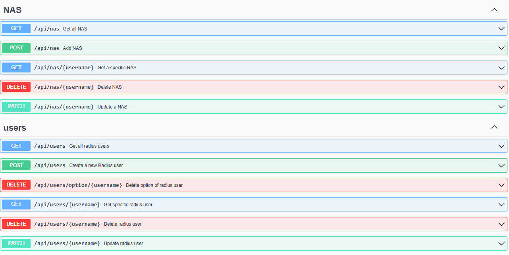

# Freeradius API (Golang)

API developed in golang that allows you to administer a freeradius server (user and NAS management).

---

## Features

- Radius user management
- Radius NAS management
- Swagger documentation

---

## Technologies used

- Go
- Gin Gonic
- FreeRADIUS
- PostgreSQL
- Swagger

---

## Configuration

Edit .env file (cmd/api/.env)
<pre>
DB_HOST=localhost
DB_USER=user
DB_PASSWORD=password
DB_NAME=radius
DB_PORT=5432
DB_SSLMODE=disable
</pre>

# Launch the API

<pre>
git clone https://github.com/Nathan0510/api-freeradius.git
cd api-freeradius/
go mod tidy
go run cmd/api/main.go
</pre>

The API will be available with localhost:8080/api

# Documentation Swagger

Available at localhost:8080/swagger/index.html

# Example API with curl

For NAS :
<pre>
Post Nas :
curl -X POST http://localhost:8080/api/nas -H "Content-Type: application/json" -d '{"nasname": "1.1.1.1","shortname": "LNS1","secret": "naruto"}'
{"message":"Nas 1.1.1.1 added successfully"}

Get all Nas :
curl http://localhost:8080/api/nas
[{"ID":14,"Nasname":"1.1.1.1","Shortname":"LNS1","Secret":"naruto","Type":"","Ports":0,"Server":"","Community":"","Description":""},{"ID":15,"Nasname":"2.2.2.2","Shortname":"LNS2","Secret":"naruto","Type":"","Ports":0,"Server":"","Community":"","Description":""}]

Get Nas :
curl http://localhost:8080/api/nas/1.1.1.1
{"ID":14,"Nasname":"1.1.1.1","Shortname":"LNS1","Secret":"naruto","Type":"","Ports":0,"Server":"","Community":"","Description":""}

Patch Nas :
curl -X PATCH http://localhost:8080/api/nas/1.1.1.1 -H "Content-Type: application/json" -d '{"secret": "sasuke"}'
{"message":"Nas 1.1.1.1 updated successfully"}

Delete Nas :
curl -X DELETE http://localhost:8080/api/nas/1.1.1.1
{"message":"Nas 1.1.1.1 deleted successfully"}
</pre>

For Users :
<pre>
Post user :
curl -X POST http://localhost:8080/api/users -H "Content-Type: application/json" -d '{"Username":"naruto@naruto.ninja","Attribute": "Cleartext-Password","Value":"beaugoss","Options":[{"Attribute": "Framed-IP-Address","Value": "100.127.0.1"},{"Attribute": "Profile-Mikrotik","Value": "Profile-Internet"}]}'
{"message":"User naruto@naruto.ninja added successfully"}

Get all user :
curl http://localhost:8080/api/users
[{"ID":1,"Username":"minato@naruto.ninja","Attribute":"Cleartext-Password","Value":"surcote","Options":[]},{"ID":2,"Username":"naruto@naruto.ninja","Attribute":"Cleartext-Password","Value":"beaugoss","Options":[{"Attribute":"Framed-IP-Address","Value":"100.127.0.1"},{"Attribute":"Mikrotik-Group","Value":"Profile-Internet"}]}]

Get user :
curl http://localhost:8080/api/users/naruto@naruto.ninja
{"ID":27,"Username":"naruto@naruto.ninja","Attribute":"Cleartext-Password","Value":"sasuke2","Options":[{"Attribute":"Framed-IP-Address","Value":"100.64.0.10"},{"Attribute":"Framed-IP-Address","Value":"100.127.0.1"},{"Attribute":"Profile-Mikrotik","Value":"Profile-Internet"},{"Attribute":"Profile-Mikrotik","Value":"Profile-Internet"}]}

Patch user :
curl -X PATCH http://localhost:8080/api/users/naruto@naruto.ninja -H "Content-Type: application/json" -d '{"Options":[{"Attribute": "Framed-IP-Address","Value": "100.127.0.10"}]}'
{"message":"User naruto@naruto.ninja updated successfully"}

Delete option user :
curl -X DELETE http://localhost:8080/api/users/option/naruto@naruto.ninja -H "Content-Type: application/json" -d '{"Attribute": "Framed-IP-Address","Value": "100.127.0.10"}'s
{"message":"Option Framed-IP-Address value 100.127.0.10 user naruto@naruto.ninja deleted successfully"}

Delete user :
curl -X DELETE http://localhost:8080/api/users/naruto@naruto.ninja
{"message":"User naruto@naruto.ninja deleted successfully"}
</pre>

Enjoy !